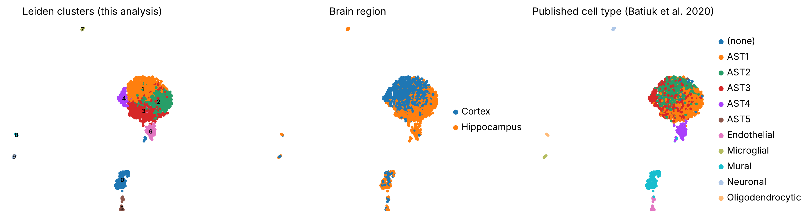
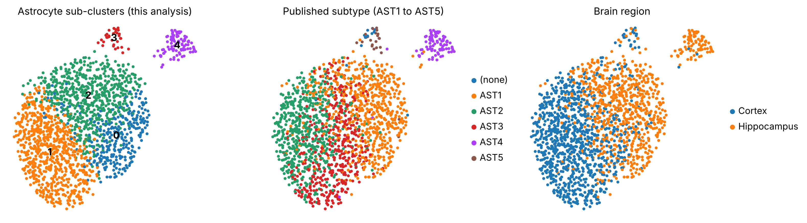
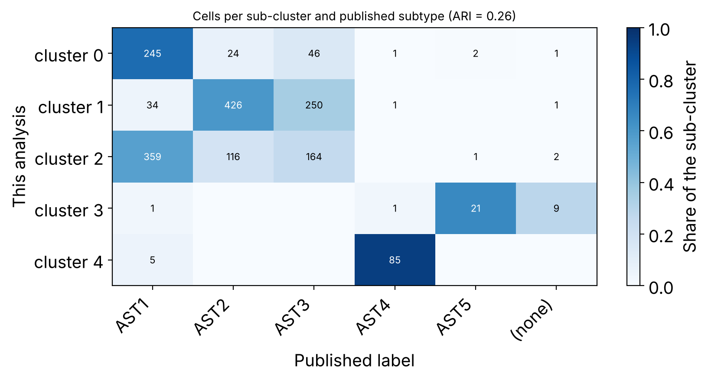
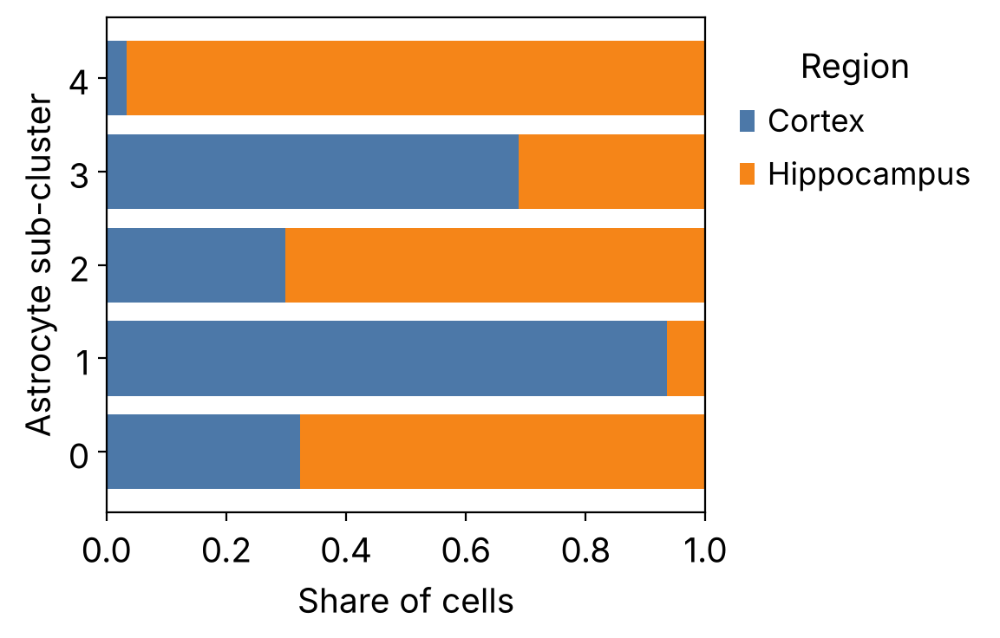
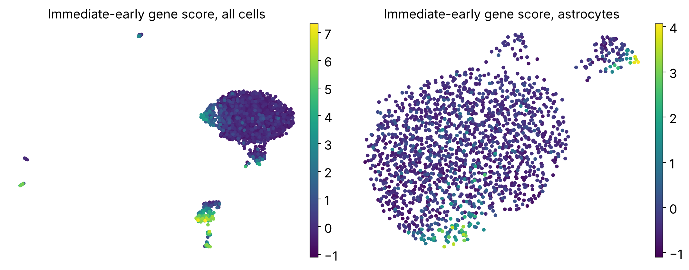

# Astrocyte single-cell RNA-seq: a training re-analysis with Scanpy

A self-directed training project in single-cell RNA-seq analysis (October 2026).
It re-analyses a public dataset of about 2,000 astrocytes from adult mouse cortex
and hippocampus and checks how much of the published structure a standard Scanpy
workflow recovers.

**Dataset.** Batiuk MY, Martirosyan A, Wahis J, et al. Identification of
region-specific astrocyte subtypes at single cell resolution. *Nature
Communications* 2020;11:1220. [doi:10.1038/s41467-019-14198-8](https://doi.org/10.1038/s41467-019-14198-8).
Data: NCBI GEO [GSE114000](https://www.ncbi.nlm.nih.gov/geo/query/acc.cgi?acc=GSE114000)
(Smart-seq2, one library per FACS-sorted cell).

## How this was made

The code was written with the help of an AI assistant (Claude, Anthropic), as a
learning scaffold; the commits record this. I am using the project to learn the
single-cell workflow step by step, and any mistake in it is mine to find and fix.
It is a training exercise. It is not new biology and it does not reproduce the
authors' own pipeline.

## What the analysis does

1. Loads the deposited count matrix (49,660 features by 2,031 cells) and the authors' metadata.
2. Quality control: genes detected, total counts, mitochondrial and ERCC spike-in share per cell; cells more than 5 median absolute deviations from the median are removed.
3. Normalisation, log transform, 2,000 highly variable genes, PCA, neighbour graph, UMAP, Leiden clustering.
4. Names each cluster from canonical marker genes, without using the published labels.
5. Re-clusters the astrocytes and compares the result with the published subtypes AST1 to AST5 (adjusted Rand index, normalised mutual information, confusion table).
6. Looks at brain-region composition and marker genes of the astrocyte sub-clusters.
7. Scores dissociation-induced immediate-early genes, a known preparation artefact.

## Results

| Quantity | Value |
|---|---|
| Cells in the deposited matrix | 2,031 |
| Cells kept after QC | 2,001 (30 removed for a high mitochondrial share) |
| Genes kept | 19,980 |
| Leiden clusters, all cells | 10, named as six cell types |
| Astrocyte versus non-astrocyte calls agreeing with the published labels | 99.3% |
| Astrocytes taken forward | 1,795 |
| Astrocyte sub-clusters (resolution 0.5) | 5 |
| Agreement with published AST1 to AST5 | ARI 0.26, NMI 0.36 |

**Broad cell types are recovered almost exactly.** Marker-based naming separates
astrocytes, mural cells, endothelial cells, neurons, oligodendrocytes and
microglia. Of 2,001 cells, 3 are called differently from the published type,
and 13 that the authors left unlabelled are called astrocytes here.



**Astrocyte subtypes are recovered only in part.** The two small, distinct
subtypes come out cleanly: one sub-cluster holds 85 of the 90 AST4 cells that
passed QC, another holds 21 of the 24 AST5 cells. The three large subtypes
(AST1, AST2, AST3) are not cleanly separated: each of my three large
sub-clusters is dominated by one or two of them. A low adjusted Rand index
(0.26) is the honest summary. Plausible reasons: these three subtypes lie on a
continuum, and this workflow uses different feature selection and no
batch handling compared with the original study.





**The regional signal is clear even where the subtype labels are not.** One
large sub-cluster is 94% cortex, two are about 70% hippocampus, and the
AST4-like sub-cluster is 97% hippocampus. In the authors' own labels, AST2 is
95% cortex, AST1 is 83% hippocampus and AST4 is 98% hippocampus, so the region
structure of this re-analysis points the same way.



**Dissociation-induced genes are mostly a non-astrocyte signal here.** The
immediate-early gene score (Fos, Jun, Egr1, Dusp1 and others) is highest in
microglia, endothelial and mural cells. One astrocyte cluster of 88 cells in the
all-cell clustering also has a raised score and Fos, Jun and Dusp1 among its top
markers, which suggests it is driven partly by the preparation and not by
resting biology.



## Limitations

- One dataset, one workflow, default-style parameters. No batch correction, although plates and animals differ.
- The sub-cluster resolution was fixed at the lowest value giving five clusters, to match the number of published subtypes; `results/astrocyte_resolution_sweep.csv` shows that the agreement changes with this choice (ARI 0.10 to 0.34).
- Cluster names come from a short marker list and a simple score.
- No statistical test of region differences, and no validation in tissue.

## Run it yourself

**In the browser, nothing to install:** open the notebook in
[Google Colab](https://colab.research.google.com/github/abmarzan/astrocyte-scrnaseq-reanalysis/blob/main/astrocyte_scrnaseq_scanpy.ipynb)
and choose Runtime, Run all. The first cell installs the packages and downloads
the data.

**On your own computer** (Python 3.12 or newer for these package versions):

```bash
python -m venv .venv && source .venv/bin/activate      # Windows: .venv\Scripts\activate
pip install -r requirements.txt
python analysis.py                                       # downloads the data, writes figures/ and results/
# or, as a notebook:
jupyter nbconvert --to notebook --execute --inplace astrocyte_scrnaseq_scanpy.ipynb
```

`analysis.py` and the notebook contain the same code; `download_data.py` fetches
the two files separately and checks their checksums. The run takes a few minutes
on a laptop. The random seed is fixed, but UMAP coordinates and cluster numbers
can still differ slightly between package versions, so small differences from
the committed numbers are expected.

## Files

| Path | Content |
|---|---|
| `astrocyte_scrnaseq_scanpy.ipynb` | Executed notebook with all outputs |
| `analysis.py` | The same analysis as a script |
| `download_data.py` | Fetches and checks the two GEO files |
| `figures/` | Eight figures |
| `results/` | Summary numbers, marker tables, confusion tables, per-cell annotations |
| `requirements.txt` | Package versions used |

## Licence

Code: MIT. The data belong to the authors of the original study and are
distributed by NCBI GEO.
